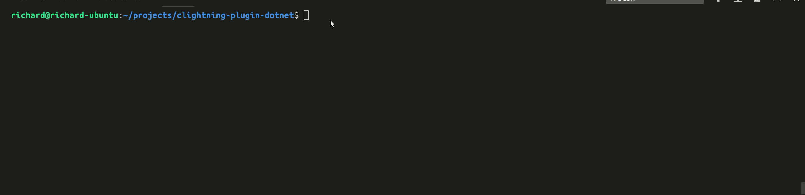
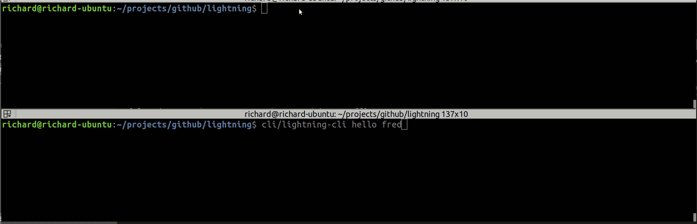

## Running code as shell

Here I put in the requests and get the expected response.

## Running the actual plugin

Here it just hangs when I give the command, then I give bad json in shell terms and you can see the passthrough is working by the error but there is a disconnect somewhere.

